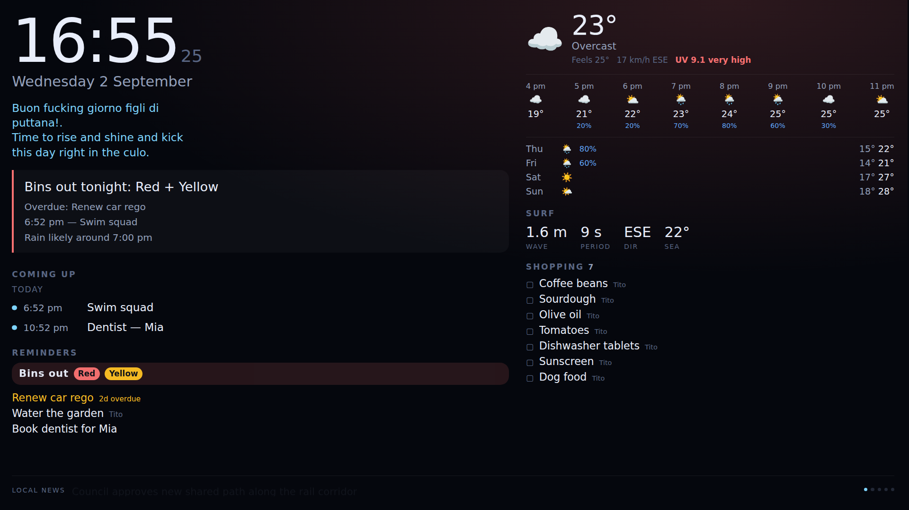

# Magic

A house dashboard for a wall-mounted screen: the time, the weather, what's on
today, what needs buying, what needs doing, and what's in the news — readable
from across the kitchen in about three seconds.



The design rule throughout is **glanceability**. Nobody stands and reads a
hallway screen; they walk past it while making coffee. So the dashboard leads
with a single synthesised line — *"Bins out tonight: Red + Yellow"* — and pushes
the raw numbers behind it.

## What's on it

| Widget | What it shows |
| --- | --- |
| `clock` | Time, date, and a rotating compliment picked by time of day and weather |
| `brief` | One headline plus up to three supporting lines, ranked by urgency |
| `weather` | Current conditions, UV band, an hourly strip, and a multi-day forecast |
| `surf` | Wave height, period, direction and sea temperature (coastal locations) |
| `agenda` | Merged calendar feeds, grouped by day, truncated to fit |
| `list` | Shopping (or any other list), writable from a phone |
| `reminders` | Chores and one-offs, plus a bin-night banner |
| `news` | Headlines from RSS/Atom feeds, rotating one at a time |

Two extra touches that do a lot of work:

- **Ambient mood.** The whole screen tints when something needs attention —
  blue for rain, amber for overdue or dangerous UV, red for bin night. You read
  the state before you read any words.
- **The phone companion** at `/phone`. A shopping list nobody can add to from
  the supermarket aisle is a decoration, not a tool.

## Architecture

```
web/     Vite + TypeScript, no framework. Renders the wall and the phone views.
server/  Fastify. Owns the upstream calls, caches them, serves one JSON state.
shared/  The types both halves agree on.
config/  dashboard.json — layout, location, feeds. The only file you edit.
```

The server polls each upstream on its own schedule, caches every response to
SQLite, and pushes the whole state to connected screens over server-sent
events. Nothing in the browser polls, and nothing in the browser holds an API
key. If the house internet drops, the screen keeps showing the last known
weather rather than an empty panel.

Weather comes from [Open-Meteo](https://open-meteo.com), which needs no API key
— the right property for a screen expected to run unattended for months.

## Running it

```bash
npm install
npm run build
npm start            # http://localhost:8080
```

For development, two terminals:

```bash
npm run dev:server   # :8080
npm run dev:web      # :5173, proxies /api to the server
```

No internet? `node scripts/fixtures.mjs` serves stand-in weather, marine, RSS
and calendar feeds on `:8999`, so the UI can be worked on offline:

```bash
node scripts/fixtures.mjs &
MAGIC_WEATHER_URL=http://127.0.0.1:8999/weather \
MAGIC_MARINE_URL=http://127.0.0.1:8999/marine \
npm start
```

Tests cover the parsing and scheduling logic — recurrence expansion, bin
rotation, brief prioritisation, and the upstream response shapes:

```bash
npm test
```

## Configuring it

Everything lives in `config/dashboard.json`.

**Where you are** — used for weather, surf and sunrise:

```json
"location": { "name": "Byron Bay", "latitude": -28.6434, "longitude": 153.6122 }
```

**Calendars.** Any iCalendar URL: Google Calendar's "secret address in iCal
format", Apple's public share link, or a self-hosted CalDAV export. `webcal://`
links work. Give each feed a colour so the agenda dots mean something.

```json
"calendar": {
  "feeds": [
    { "name": "Family", "url": "https://…/basic.ics", "colour": "#7dd3fc" },
    { "name": "Work",   "url": "webcal://…",          "colour": "#fbbf24" }
  ]
}
```

**Bins.** Councils publish a zone and a rotation, not an API, so set an anchor
date you know was a collection day and let it count forward:

```json
"bins": {
  "anchorDate": "2026-09-02",
  "cadenceDays": 7,
  "alternating": [["general", "recycling"], ["general", "green"]],
  "remindFromHour": 16
}
```

That gives red every week, alternating yellow and green — and a banner from 4pm
the evening before.

**Layout.** The grid is a CSS template you can rearrange without touching code.
Each widget names the area it belongs to; several widgets can share one area and
stack in order.

```json
"layout": {
  "columns": "1.35fr 1fr",
  "rows": "auto 1fr auto",
  "areas": ["hero aside", "agenda aside", "ticker ticker"]
}
```

**Compliments** reuse the MagicMirror file format, so an existing
`custom_compliments.json` drops straight in. Keys are `morning`, `afternoon`,
`evening`, `anytime`, or weather buckets like `day_sunny`, `rain`, `fog`.

### Environment variables

| Variable | Purpose |
| --- | --- |
| `PORT`, `HOST` | Where the server listens (default `8080`, `0.0.0.0`) |
| `MAGIC_CONFIG` | Path to an alternative `dashboard.json` |
| `MAGIC_DATA_DIR` | Where the SQLite database lives (default `./data`) |
| `MAGIC_WEATHER_URL` | Override the Open-Meteo forecast endpoint |
| `MAGIC_MARINE_URL` | Override the Open-Meteo marine endpoint |

## Putting it on the wall

On a Raspberry Pi with Chromium:

```bash
git clone <this repo> ~/magic && cd ~/magic
npm install && npm run build

sudo cp deploy/magic.service /etc/systemd/system/
sudo systemctl enable --now magic

chmod +x deploy/kiosk.sh
```

Then run `deploy/kiosk.sh` from the desktop session's autostart. It waits for
the server, disables screen blanking, hides the cursor, and clears the
restore-pages bubble that a power cut would otherwise leave on your wall.

The phone companion is at `http://<pi-address>:8080/phone` — add it to the home
screen on each phone in the house.

Two display niceties are on by default: the layout nudges itself a few pixels
every five minutes to spare the panel from burn-in, and it dims and warms after
`nightMode.from` so it stops lighting the hallway at 2am.

## The API

The phone view uses the same endpoints you would for anything else — a
voice assistant, a shortcut, a button by the door.

```
GET    /api/bootstrap            config + state, for a cold start
GET    /api/state                current state
GET    /api/stream               server-sent events; `state` frames
GET    /api/health               per-source freshness
POST   /api/refresh              force an upstream refresh

POST   /api/lists/:listId/items  { text, note?, addedBy? }
PATCH  /api/lists/items/:id      { done? } or { text, note? }
DELETE /api/lists/items/:id
POST   /api/lists/:listId/clear  remove completed items

POST   /api/reminders            { text, dueAt?, repeat?, assignee? }
PATCH  /api/reminders/:id        { done }   — repeating ones roll forward
DELETE /api/reminders/:id
```

Adding an item from anywhere pushes to every screen immediately:

```bash
curl -X POST http://magic.local:8080/api/lists/shopping/items \
  -H 'content-type: application/json' \
  -d '{"text":"Coffee beans","addedBy":"Tito"}'
```

There is no authentication. This is designed for a home LAN, and it should stay
there — do not port-forward it.

## Adding a widget

1. Add the type to `WidgetType` in `shared/types.ts`.
2. Write `web/src/widgets/yours.ts` exporting a `WidgetFactory` — build the
   root element once, patch it in `update()`.
3. Register it in the `FACTORIES` map in `web/src/dashboard.ts`.
4. Add an entry to `widgets` in `config/dashboard.json`.

If it needs new data, add a source under `server/src/sources/`, poll it in
`store.ts`, and hang it off `DashboardState`. Sources cache to SQLite and fail
soft: a source that errors keeps its last good value and marks itself unhealthy
rather than blanking the screen.

## Known limits

- **Timezones in calendar feeds.** `VTIMEZONE` blocks are not read. A `TZID`
  the runtime recognises is used directly; anything else falls back to the
  household timezone. That is right for a family calendar and wrong for a feed
  full of events in cities you do not live in.
- **Recurrence rules.** `FREQ`, `INTERVAL`, `COUNT`, `UNTIL`, `BYDAY` and
  `BYMONTHDAY` are handled, including nth-weekday forms like `2TU`. `BYSETPOS`,
  `BYWEEKNO` and `WKST` are not.
- **Marine data** covers a coastal grid. Set `sources.surf.enabled` to `false`
  if you are inland, or the panel simply hides itself.
